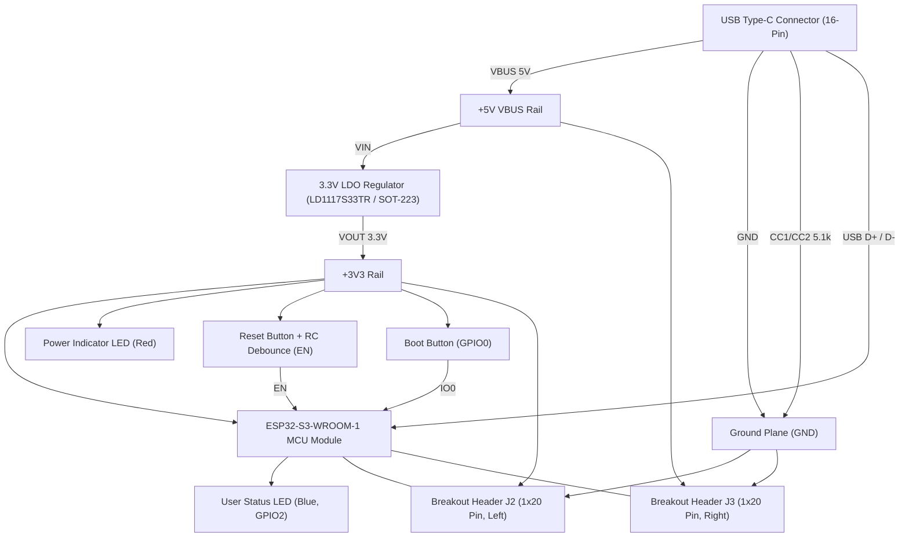

# ESP32-S3 Development Board Implementation Plan

## System Architecture Diagram

---

## Technical Specifications

| Parameter | Specification |
| :--- | :--- |
| **Microcontroller** | Espressif ESP32-S3-WROOM-1 (Xtensa dual-core LX7 up to 240 MHz, 512 KB SRAM, 2.4 GHz Wi-Fi + BLE 5.0) |
| **USB Interface** | USB Type-C Receptacle (USB 2.0 16-pin) with native USB CDC / JTAG direct to GPIO19 (D-) and GPIO20 (D+) |
| **Power Input** | 5V nominal via USB-C VBUS |
| **Voltage Regulation** | 3.3V LDO (LD1117S33TR / AMS1117-3.3 in SOT-223 package), rated for 800mA continuous / 1A peak |
| **Input Capacitance** | 10 µF 0603 ceramic capacitor |
| **Output Capacitance** | 22 µF 0603 ceramic capacitor + 100 nF 0603 ceramic high-frequency decoupling |
| **Control Elements** | Tactile pushbuttons for Reset (EN) and Bootloader Entry (GPIO0) |
| **Visual Indicators** | 3.3V Power LED (Red) and User Indicator LED (Blue, GPIO2) with 1 kΩ ballast resistors |
| **Expansion Interface** | Dual 1x20 2.54 mm (0.1") pitch vertical pin headers spaced for standard 300/600-mil breadboards |
| **PCB Dimensions** | 55.0 mm × 26.0 mm (standard narrow dev board profile) |
| **Layer Stackup** | 2-layer FR-4, 1.6 mm thickness, 1 oz copper (35 µm), top/bottom continuous GND pour |

---

## Detailed Bill of Materials & Symbol Mapping

| Reference | Qty | Value | Symbol Library ID | Footprint Library ID |
| :--- | :--- | :--- | :--- | :--- |
| **U1** | 1 | ESP32-S3-WROOM-1 | `RF_Module:ESP32-S3-WROOM-1` | `RF_Module:ESP32-S3-WROOM-1` |
| **U2** | 1 | LD1117S33TR_SOT223 | `Regulator_Linear:LD1117S33TR_SOT223` | `Package_TO_SOT_SMD:SOT-223-3_TabPin2` |
| **J1** | 1 | USB_C_Receptacle_USB2.0_16P | `Connector:USB_C_Receptacle_USB2.0_16P` | `Connector_USB:USB_C_Receptacle_GCT_USB4105-xx-A_16P_TopMnt_Horizontal` |
| **J2** | 1 | Conn_01x20 (Left Header) | `Connector_Generic:Conn_01x20` | `Connector_PinHeader_2.54mm:PinHeader_1x20_P2.54mm_Vertical` |
| **J3** | 1 | Conn_01x20 (Right Header) | `Connector_Generic:Conn_01x20` | `Connector_PinHeader_2.54mm:PinHeader_1x20_P2.54mm_Vertical` |
| **SW1** | 1 | SW_Push (Reset / EN) | `Switch:SW_Push` | `Button_Switch_SMD:SW_SPST_PTS810` |
| **SW2** | 1 | SW_Push (Boot / IO0) | `Switch:SW_Push` | `Button_Switch_SMD:SW_SPST_PTS810` |
| **D1** | 1 | LED Red (Power) | `Device:LED` | `LED_SMD:LED_0603_1608Metric` |
| **D2** | 1 | LED Blue (User GPIO2) | `Device:LED` | `LED_SMD:LED_0603_1608Metric` |
| **C1** | 1 | 10uF 16V | `Device:C` | `Capacitor_SMD:C_0603_1608Metric` |
| **C2** | 1 | 22uF 10V | `Device:C` | `Capacitor_SMD:C_0603_1608Metric` |
| **C3, C4, C5** | 3 | 100nF 50V | `Device:C` | `Capacitor_SMD:C_0603_1608Metric` |
| **R1, R2** | 2 | 5.1k (USB-C CC1, CC2) | `Device:R` | `Resistor_SMD:R_0603_1608Metric` |
| **R3, R4** | 2 | 10k (EN pull-up, IO0 pull-up) | `Device:R` | `Resistor_SMD:R_0603_1608Metric` |
| **R5, R6** | 2 | 1k (LED ballast) | `Device:R` | `Resistor_SMD:R_0603_1608Metric` |

---

## Schematic Design & Pin Mapping

### Pin Header J2 (Left Side Breakout, 20 Pins)
1. **+3V3** (Power Output)
2. **GND** (Power Ground)
3. **EN** (Module Enable / Reset)
4. **IO4**
5. **IO5**
6. **IO6**
7. **IO7**
8. **IO15**
9. **IO16**
10. **IO17**
11. **IO18**
12. **IO8**
13. **USB_D-** (IO19 / Native USB D-)
14. **USB_D+** (IO20 / Native USB D+)
15. **IO3**
16. **IO46**
17. **IO9**
18. **IO10**
19. **IO11**
20. **IO12**

### Pin Header J3 (Right Side Breakout, 20 Pins)
1. **+5V** (VBUS Power Input/Output)
2. **GND** (Power Ground)
3. **IO1**
4. **IO2** (User LED indicator line)
5. **TXD0** (UART0 Transmit)
6. **RXD0** (UART0 Receive)
7. **IO42**
8. **IO41**
9. **IO40**
10. **IO39**
11. **IO38**
12. **IO37**
13. **IO36**
14. **IO35**
15. **IO0** (Boot mode select)
16. **IO45**
17. **IO48**
18. **IO47**
19. **IO21**
20. **IO14**

---

## PCB Physical Constraints & Design Rules

- **Board Size**: 55.0 mm × 26.0 mm with 1.5 mm rounded corners on `Edge.Cuts`.
- **Antenna Keepout**: Top edge (first 7 mm) kept entirely free of copper pours, traces, and components on all layers to ensure optimal RF performance for the integrated meandered inverted-F antenna (MIFA).
- **Track Widths**:
  - Power Rails (+5V, +3V3): 0.60 mm – 0.80 mm for low impedance and low temperature rise under peak TX bursts (up to 500 mA).
  - High-Speed USB Signals (USB_D+, USB_D-): 0.30 mm trace with 0.20 mm spacing, matched differential length.
  - General Logic Signals: 0.25 mm trace width.
- **Clearance**: Minimum 0.20 mm copper-to-copper, copper-to-pad, and track-to-via clearance.
- **Ground Strategy**: Unbroken ground planes on both Top (`F.Cu`) and Bottom (`B.Cu`) layers, interconnected with thermal vias under the ESP32-S3 exposed thermal pad (Pin 41) and adjacent to high-current ground return paths.
