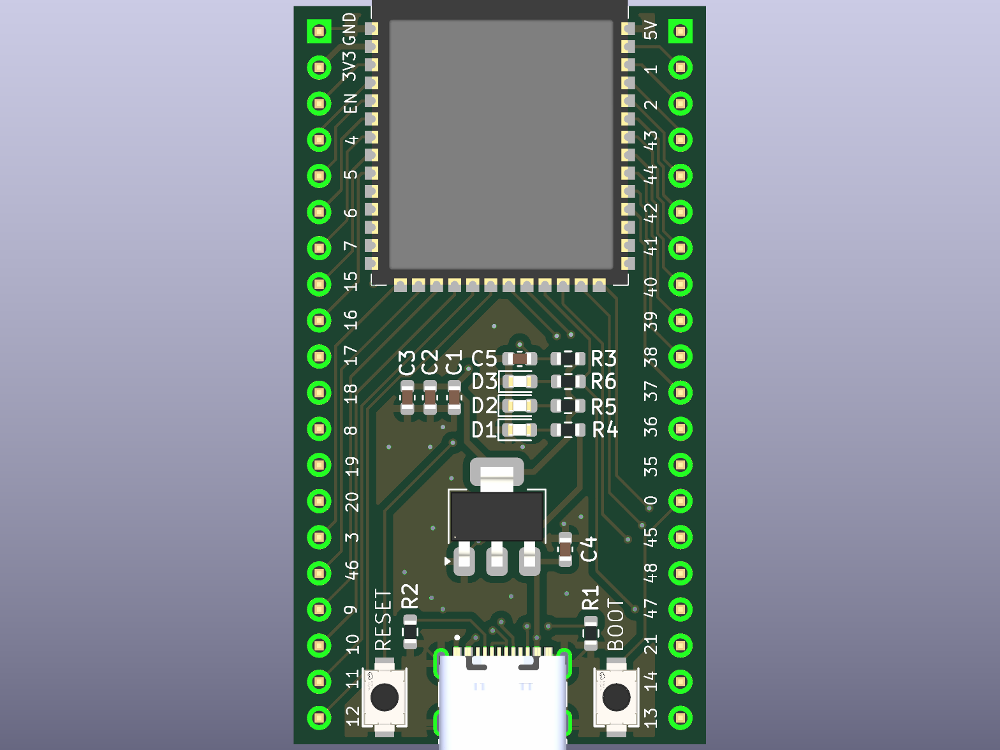

# ESP32 Dev Board

English in. KiCad out. Clean ERC, clean DRC, rendered PCB.

```python
from copper_pilot_cli.copper_protocol import CopperMode
from copper_pilot_cli.langchain import CopperPilotAgent
from helper import drc_violations, erc_errors, render_pcb, run

PLAN = CopperMode.PLAN

copper_pilot = CopperPilotAgent(workspace="esp32")

run(copper_pilot, "Build me an ESP32 dev board.", PLAN)
run(copper_pilot, "Let us build this plan.")
run(copper_pilot, "Inspect the PCB, check for any missing 3D models, and apply them accordingly.")

assert erc_errors() == 0
assert drc_violations() == 0
render_pcb("esp32.png")
```



```console
python examples/001_esp32/main.py
```

Python 3.12, `pip install -e .`, `copper-pilot auth login`, and KiCad 10 on `PATH`.
