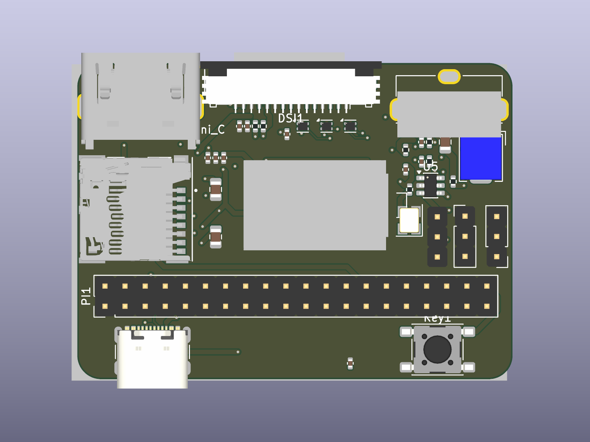

# CM5 Camera Carrier

English in. KiCad out. CM5 camera carrier. Clean ERC, clean DRC, rendered PCB.

```python
from copper_pilot_cli.copper_protocol import CopperMode
from copper_pilot_cli.langchain import CopperPilotAgent
from helper import (
    already_done,
    discard_stale_plan,
    drc_violations,
    erc_errors,
    ensure_outer_gnd_zones,
    footprints_have_3d_models,
    format_netlist_contract,
    format_placement_spec,
    hosted_plan_prompt,
    inject_feedback,
    libraries_ready,
    lock_diff_tracks,
    lock_placement,
    netlist_matches,
    pcb_matches_schematic,
    pcb_segment_count,
    placement_feedback,
    placement_matches_spec,
    plan_has_spec,
    refill_zones,
    render_pcb,
    repair_drc,
    repair_erc,
    reset_pcb_copper,
    restore_pcb_if_wiped,
    route_headless,
    run,
    snapshot_pcb,
    solidify_plane_pad_connections,
    start,
    strip_high_speed_from_planes,
    telemetry_prompt,
    unconnected_count,
    zones_and_rules_ready,
)

PLAN = CopperMode.PLAN

PLAN_PROMPT = hosted_plan_prompt()
LIBS_PROMPT = (
    "Set up symbols and footprints for this CM5 camera project, reverse-engineered "
    "from Waveshare CM4-NANO-C (https://www.waveshare.com/wiki/CM4-NANO-C) and "
    "aligned with https://github.com/rapidanalysis/xerxes DF40 practice. "
    "Goal: project libraries must include every BOM row from the plan."
)
SCHEMATIC_PROMPT = (
    "Implement schematic capture in cm5_camera/cm5_camera.kicad_sch. "
    "Goal: kicad-cli `sch export netlist --format kicadxml` must contain these "
    "nets and connections:\\n"
    f"{format_netlist_contract()}\\n"
    "Use those net names. Populate Type_C1, U5, U1-U3, X1, Q1/Q2, L1-L3, J1 IMX219, "
    "U6, HDMI1, DSI1, TF1, PI1, Key1, and the CM5 DF40 module."
)
ERC_PROMPT = (
    "Run kicad-cli sch erc on cm5_camera/cm5_camera.kicad_sch and fix pin types, "
    "power flags, and floating inputs. Goal: zero ERC errors."
)
UPDATE_PCB_PROMPT = (
    "Update PCB footprints from the schematic. Goal: every schematic symbol with a "
    "footprint is on cm5_camera/cm5_camera.kicad_pcb, extra footprints are removed, "
    "and the netlist is imported."
)
LAYOUT_PROMPT = (
    "Lay out cm5_camera/cm5_camera.kicad_pcb from a wiped copper state. "
    "Goal: Edge.Cuts 55.0 x 40.0 mm with 3.0 mm corner radii and 4x M2.5 holes at "
    "board-local 3.5,3.5 / 3.5,36.5 / 51.5,3.5 / 51.5,36.5. Place and lock "
    "footprints to this board-local table (origin = SW of Edge.Cuts). J1 is east "
    "of center, not the board middle. HDMI1/DSI1 north, J2 east, TF1 west, "
    "Type_C1 south-west, PI1 west, Key1 south-east, DF40 on B.Cu. Silk: CM5 CAMERA.\\n"
    f"{format_placement_spec()}"
)
ZONES_PROMPT = (
    "Configure the 6-layer SIG-GND-SIG-PWR-GND-SIG stackup and pour planes. "
    "Goal: F.Cu, In1.Cu, In2.Cu, In3.Cu, In4.Cu, B.Cu present; solid GND zone on "
    "In1.Cu and In4.Cu; split CM5_5V and PWR_3V3 zones on In3.Cu; netclasses "
    "100Ohm_Diff (0.15 mm / 0.18 mm gap), 90Ohm_Diff (0.18 mm / 0.20 mm), "
    "Power_5V, Power_3V3 in cm5_camera.kicad_pro; refill zones. Do not autoroute."
)
ACK_PROMPT = (
    "Reply with the single word OK. Do not call tools. Do not edit files. "
    "Do not run kicad_autorouter or FreeRouting. Local headless routing already "
    "imported copper."
)
MODELS_3D_PROMPT = (
    "Inspect kicad-cli pcb render of cm5_camera/cm5_camera.kicad_pcb and assign "
    "3D models. Goal: the CM5 module, IMX219, Mini-HDMI, USB-C, USB-A, Micro SD, "
    "and GPIO header all have 3D models; re-render the top side."
)

copper_pilot = CopperPilotAgent(workspace="cm5_camera")
start(copper_pilot)
discard_stale_plan()
if not already_done(plan_has_spec):
    run(copper_pilot, PLAN_PROMPT, PLAN)
assert plan_has_spec()
if not already_done(libraries_ready):
    run(copper_pilot, LIBS_PROMPT)
assert libraries_ready()
if not already_done(netlist_matches):
    run(copper_pilot, SCHEMATIC_PROMPT)
assert netlist_matches()
if not already_done(lambda: erc_errors() == 0):
    run(copper_pilot, ERC_PROMPT)
    repair_erc()
assert erc_errors() == 0
if not already_done(pcb_matches_schematic):
    run(copper_pilot, UPDATE_PCB_PROMPT)
assert pcb_matches_schematic()

has_routes = pcb_segment_count() >= 50
keep_zones = already_done(placement_matches_spec) and already_done(zones_and_rules_ready)
if not has_routes:
    reset_pcb_copper(keep_zones=keep_zones)
    inject_feedback(
        "Tracks and vias were wiped"
        + ("." if keep_zones else ", along with zones.")
        + " Rebuild layout, stackup, and routing from the CM5 camera spec in this "
        "same conversation."
    )
if not already_done(placement_matches_spec):
    run(copper_pilot, LAYOUT_PROMPT)
    if not already_done(placement_matches_spec):
        run(copper_pilot, placement_feedback())
    if not already_done(placement_matches_spec):
        locked = lock_placement()
        inject_feedback(
            "Locked these footprints to the board-local assembly table: "
            + ", ".join(locked)
            + ". Continue from this placement; do not scatter parts."
        )
assert placement_matches_spec()

if not already_done(zones_and_rules_ready):
    run(copper_pilot, ZONES_PROMPT)
    if not already_done(zones_and_rules_ready):
        run(
            copper_pilot,
            "Finish the 6-layer stackup, 100Ohm_Diff / 90Ohm_Diff / Power_5V / "
            "Power_3V3 netclasses, GND pours on In1.Cu and In4.Cu, and CM5_5V plus "
            "PWR_3V3 pours on In3.Cu. Do not autoroute.",
        )
assert zones_and_rules_ready()

if not has_routes:
    diffs = route_headless(stage="diffs")
    if strip_high_speed_from_planes():
        diffs = route_headless(stage="diffs", passes=3)
        strip_high_speed_from_planes()
    lock_diff_tracks()
    leftover = unconnected_count()
    copper = snapshot_pcb()
    inject_feedback(telemetry_prompt(diffs, leftover=leftover))
    run(copper_pilot, ACK_PROMPT)
    restore_pcb_if_wiped(copper)
    assert high_speed_not_on_planes()

ensure_outer_gnd_zones()
solidify_plane_pad_connections()
if pcb_segment_count() < 700:
    gpio = route_headless(stage="gpio")
    if unconnected_count() > 0:
        gpio = route_headless(stage="gpio", passes=12)
    leftover = unconnected_count()
    copper = snapshot_pcb()
    inject_feedback(telemetry_prompt(gpio, leftover=leftover))
    run(copper_pilot, ACK_PROMPT)
    restore_pcb_if_wiped(copper)
refill_zones()
if drc_violations():
    repair_drc()
if not already_done(footprints_have_3d_models):
    run(copper_pilot, MODELS_3D_PROMPT)
assert footprints_have_3d_models()
render_pcb("cm5_camera.png")
assert high_speed_not_on_planes()
assert drc_violations() == 0
leftover = unconnected_count()
assert leftover == 0, f"{leftover} unconnected items remain"
```



```console
python examples/002_cm5_camera/main.py
```

Python 3.12, `pip install -e .`, `copper-pilot auth login`, and KiCad 10 on `PATH`.
